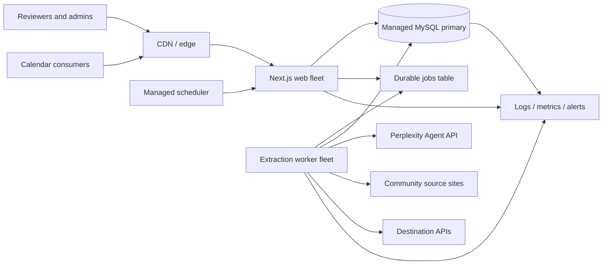
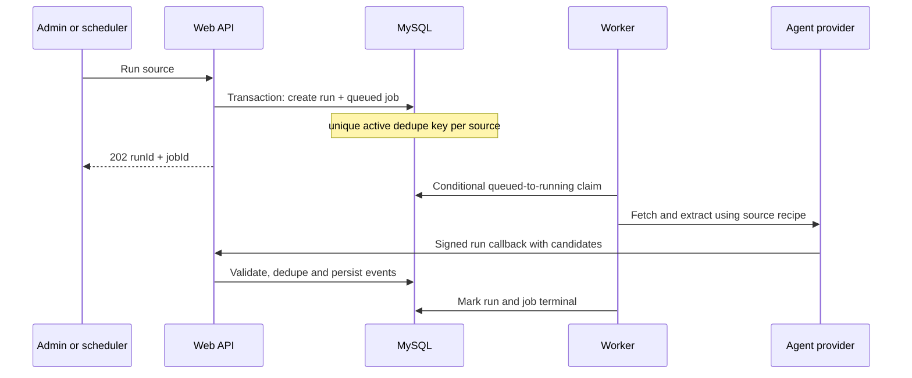

# AI Calendar production architecture

## Executive decision

AI Calendar should remain a **modular monolith with separate web and worker processes** until its load or team structure proves that a service split is necessary. The web application, worker, and scheduler share one versioned TypeScript codebase and one transactional MySQL database. Public reads are absorbed by the CDN; long-running extraction is handed to a durable database queue; publishing uses an idempotent outbox.

This is the smallest architecture that has the production properties the product needs now:

- no event extraction is lost when an HTTP instance terminates;
- two instances cannot actively extract the same source at once;
- tenant boundaries are enforced in application queries;
- destination publishing is idempotent;
- authentication throttles apply across the whole fleet;
- web nodes stay stateless and can scale horizontally;
- queue, cache, and storage implementations can be replaced behind narrow boundaries.

It deliberately does not add Kubernetes, Kafka, or a standalone Redis cluster at pilot scale.

## System architecture



### Runtime components

| Component | Responsibility | Scaling model |
| --- | --- | --- |
| CDN/edge | TLS, public-feed response cache, request shielding | Managed, global |
| Web process | UI, auth, validation, tenant-scoped CRUD, enqueue commands | Stateless horizontal replicas |
| Worker process | Claims durable jobs, fetches sources, calls models, ingests candidates | Horizontal replicas, bounded concurrency |
| Scheduler | Enqueues due sources, retention, stale-lease recovery | Single logical schedule; duplicate ticks are safe |
| MySQL | System of record, transactions, queue leases, idempotency records | Managed HA primary; read replica later |
| Object storage (next extraction) | Event images and large artifacts | Add before image volume becomes material |
| Observability | Structured logs, traces, metrics and paging | Managed provider |

The current Vercel deployment may execute a worker immediately with `after()`, but the job is committed first. If that invocation dies, a later call to `/api/internal/jobs` recovers and runs the same durable work. At higher volume, the same endpoint/library is run by dedicated containers without changing the control-plane APIs.

## Component structure

```text
src/
  app/
    (app)/                  authenticated UI and server-rendered reads
    api/
      auth/                 identity endpoints
      sources/              source control plane
      events/               review commands
      agent/ingest/          signed agent callback
      public/events/         legacy public feed
      v1/events/             stable public API alias
      internal/jobs/         private worker entrypoint
      health/live|ready/     platform health probes
  db/
    schema.ts                relational model and indexes
    index.ts                 bounded process-local connection pool
  lib/
    auth.ts                  session and authorization primitives
    data.ts                  tenant-scoped query layer
    jobs.ts                  durable dispatch, lease, recovery and drain
    agent.ts                 extraction/discovery orchestration
    ingest.ts                normalization, validation and deduplication
    publishEvent.ts          destination adapter and idempotent outbox
    rateLimit.ts             fleet-wide authentication throttling
    runEvents.ts             append-only run timeline
    config.ts                readiness-safe configuration validation
```

Keep domain logic in `src/lib`, not route handlers. Route handlers authenticate, validate, invoke one application operation, and translate its result to HTTP. If the system later splits, `jobs.ts`, `ingest.ts`, and `publishEvent.ts` are the natural service boundaries.

## Data flow

### Scheduled or manual extraction



Important invariants:

1. A run and job are created in one transaction.
2. `jobs.dedupe_key` is unique while active and cleared only at a terminal state.
3. A worker owns a job only after a conditional status update succeeds.
4. A terminated worker leaves a recoverable lease, not lost work.
5. Agent callbacks are authenticated with a per-run HMAC.
6. Publishing is protected by `(event_id, destination_id, payload_hash)`.

### Review and publish

1. The reviewer reads events through a community-scoped query.
2. Approval updates the local review state.
3. `publishEvent` resolves the source or community destination.
4. The exact payload is hashed and claimed in `publish_submissions`.
5. A successful destination response records the remote ID. An ambiguous timeout remains unreconciled and is never blindly retried.

For the next reliability increment, approval and outbox creation should be one transaction and a publisher worker should perform the network request. The existing outbox schema already supports that evolution.

### Public read

1. Consumers call `GET /api/v1/events`.
2. The edge caches each query for 60 seconds and may serve stale data for 300 seconds during refresh.
3. A cache miss runs an indexed tenant/status/time query against MySQL.
4. The response contains no run internals, credentials, or reviewer identities.

## API design

### Resource conventions

- Stable external resources live under `/api/v1`.
- Browser/session endpoints remain under `/api/auth`.
- Machine-only operations live under `/api/internal` and require bearer authentication.
- Commands that create asynchronous work return `202 Accepted` with identifiers.
- Tenant identifiers come from the authenticated session for private APIs; clients cannot elevate scope by sending another tenant ID.
- Public list limits are bounded server-side.
- Mutations must be idempotent or carry an idempotency record.

### Implemented endpoints

| Method | Endpoint | Purpose | Authentication |
| --- | --- | --- | --- |
| GET | `/api/v1/events` | Versioned public event feed | Public |
| POST | `/api/sources/:id/run` | Enqueue extraction; returns `runId`, `jobId` | Admin session |
| GET | `/api/runs/:id/events?after=` | Incremental run timeline | Tenant session |
| POST | `/api/events/:id/approve` | Review and publish | Tenant session |
| POST | `/api/agent/ingest` | Candidate callback | Per-run HMAC |
| POST | `/api/internal/jobs?limit=2` | Recover and drain jobs | Worker bearer secret |
| GET | `/api/health/live` | Process liveness | Platform |
| GET | `/api/health/ready` | Config + database readiness | Platform |

The legacy `/api/public/events` route remains available while consumers migrate to `/api/v1/events`.

### Next API compatibility improvements

- Standardize errors as `{ error: { code, message, requestId, details? } }`.
- Replace large offset scans with an opaque `(start_time_max,id)` cursor.
- Require `Idempotency-Key` for externally initiated mutation endpoints.
- Publish an OpenAPI document and run compatibility checks in CI.

## Database schema

### Ownership and access

| Tables | Purpose |
| --- | --- |
| `communities`, `destinations` | Tenant and outbound integration configuration |
| `users`, `user_communities`, `reviewer_sources` | Identity, role and membership |
| `login_tokens` | Single-use, expiring authentication material |

### Ingestion and review

| Tables | Purpose |
| --- | --- |
| `sources` | Fetch recipe, schedule, mode and provenance |
| `runs`, `run_state`, `run_events` | Execution state and append-only observable timeline |
| `events` | Normalized review and calendar record |
| `event_identities`, `event_identity_links` | Cross-community identity without cross-tenant suppression |
| `source_rules`, `field_edit_log`, `rejection_log` | Reviewer feedback and learning trail |

### Reliability primitives

| Tables | Purpose |
| --- | --- |
| `jobs` | Durable queue, unique active dedupe key, lease and bounded recovery |
| `publish_submissions` | Destination outbox and payload-level idempotency |
| `rate_limit_buckets` | Hashed, fleet-wide authentication counters |
| `app_settings` | Small platform configuration values |

Every high-cardinality access path needs an index beginning with its partition/filter columns. Existing examples include `(community_id, dedup_key)`, `(status, start_time_max)`, `(status, available_at)`, and `(run_id, id)`. At larger scale, add composite public-feed indexes based on observed query plans, then archive old run events rather than vertically scaling the primary forever.

## Caching strategy

| Layer | Data | Policy | Invalidation |
| --- | --- | --- | --- |
| CDN | Public `/api/v1/events` responses | 60 s fresh, 300 s stale-while-revalidate | TTL now; surrogate-key purge later |
| Browser | Authenticated or mutable resources | `no-store` | Not applicable |
| Process memory | Immutable constants and provider metadata only | Short TTL | Process recycle |
| Redis (future) | Hot dashboard aggregates, sessions if JWT is retired, distributed locks only if DB queue is replaced | Explicit TTL | Write-through/event invalidation |
| MySQL | Source of truth | No application-level stale cache for commands | Transactions |

Do not cache authorization decisions or review queues at the CDN. Do not introduce Redis merely to mirror database rows. Add it when measured database read amplification or sub-second invalidation requirements justify another failure domain.

## Security and tenant isolation

- Session cookies are HTTP-only, secure in production, and signed with a configured secret.
- Readiness fails when production secrets are missing or weak.
- Authentication throttles use HMAC-hashed keys and a shared database counter.
- Private worker operations require `WORKER_SECRET` (or `CRON_SECRET` during transition).
- The UI never receives provider keys or destination credentials.
- Source content is treated as untrusted data in model prompts.
- Database credentials should be least-privilege; CommunityHub inventory credentials remain read-only.
- Tenant scoping must remain explicit in every event/source query. A future defense-in-depth move is PostgreSQL row-level security if the database platform changes.

## Operations and SLOs

Initial service objectives:

- public feed availability: 99.9% monthly;
- private control-plane availability: 99.5% monthly;
- p95 cached public read: under 250 ms;
- p95 uncached control-plane request: under 750 ms, excluding async work;
- 99% of queued extraction jobs claimed within 2 minutes;
- no silent publishing duplicates.

Alert on readiness failures, queue age, stale leases, extraction failure ratio, destination ambiguity, database pool saturation, auth throttle volume, and model cost per accepted event. Add structured JSON logs with `requestId`, `communityId`, `sourceId`, `runId`, and `jobId`; never log tokens, passwords, raw cookies, or destination credentials.

## Deployment and evolution

### Today

- Next.js web and immediate worker execution on Vercel.
- Managed MySQL with a small per-process pool.
- Vercel/managed scheduler invokes maintenance.
- CDN caches public reads.

### Growth step 1

- Invoke `/api/internal/jobs` every minute or run the same drain loop in one dedicated worker service.
- Move `image_data` blobs to object storage and retain only object keys/URLs in MySQL.
- Add OpenTelemetry and queue-age dashboards.
- Add online, reviewed migrations to CI/CD.

### Growth step 2

- Scale worker concurrency independently from the web fleet.
- Add a MySQL read replica for analytics/public cache fills.
- Partition or archive `run_events` by age.
- Add Redis only for measured hot reads or finer-grained invalidation.

### Growth step 3

- Replace the database queue with a managed queue if sustained job volume or delivery policies exceed MySQL's comfortable range.
- Extract publishing or ingestion into a service only when ownership, deploy cadence, or load isolation requires it. Preserve the same job and outbox contracts.

## Verification gates

Before release:

1. Apply the generated migration in staging and confirm existing schema drift has been reconciled.
2. Run `npm test`, `npm run typecheck`, and `npm run build`.
3. Enqueue the same source concurrently and verify both requests return one active `runId`.
4. Terminate a worker mid-run, age its lease in staging, and confirm it is recovered.
5. Load-test `/api/v1/events` through the CDN and confirm origin request collapse.
6. Verify readiness returns 503 for a missing secret and 200 for the complete deployment configuration.

