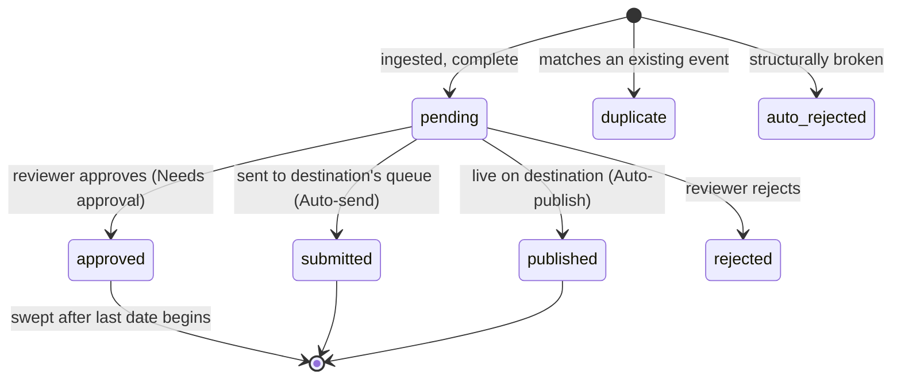

# Data model

The schema is defined in one file, [`src/db/schema.ts`](../src/db/schema.ts), with Drizzle ORM on MySQL 8. Migrations are generated into [`drizzle/`](../drizzle) with `npm run db:generate` and applied with `npm run db:migrate`. For how the tables group into ownership, ingestion and reliability concerns, see [ARCHITECTURE.md → Database schema](ARCHITECTURE.md#database-schema).

## Tenancy

Almost every row carries a `community_id`. Private APIs take the community from the session and filter on it, so one community can never read or change another's sources, events or users. `event_identities` links the same real-world event across communities without letting one community's decision hide the event from another.

## Event lifecycle

| Status | Meaning |
| --- | --- |
| `pending` | Waiting in this app's review queue. Also used for *proposals*: a changed version of an already-sent event, linked by `proposed_update_of_event_id`. |
| `approved` | A reviewer here read it and it was sent to the destination. |
| `submitted` | Sent without review here; waiting in the destination's own queue. |
| `published` | Sent without review at either end; live on the destination. |
| `rejected` | Turned down by a reviewer, with a reason. Feeds the learning agent. |
| `duplicate` | Matches another event; `duplicate_of_event_id` / `duplicate_of_url` say which. |
| `auto_rejected` | Failed the server's structural checks and was kept for inspection. |

`approved`, `submitted` and `published` all sit on the destination. They record who was accountable for checking it.

## `events`

| Column | Notes |
| --- | --- |
| `event_type` | `ot` event, `an` announcement, `jp` job posting. |
| `title`, `description`, `extended_description` | Short and long text. |
| `sessions` | JSON array of `{ startTime, endTime }` in Unix seconds. One event can have many dates. |
| `start_time_max` | Latest session start, indexed; drives ordering, `upcoming` and retention. |
| `location_type` | `ph2` in person, `on` online, `bo` both. |
| `location`, `place_name`, `room_num`, `url_link` | Where it happens, physically or online. |
| `post_type_ids`, `sponsors`, `buttons`, `display_type`, `screens_ids` | Categories, sponsors, extra action links, and which Community Dashboard signs show it. |
| `image_cdn_url`, `image_data` | Image link and the stored, shrunk JPEG (base64) the app serves itself. |
| `website`, `registration_url`, `contact_email`, `phone` | Contact details. |
| `calendar_source_name`, `calendar_source_url`, `ingested_post_url` | Attribution back to the original page. |
| `dedup_key`, `provenance` | Duplicate detection and whether it came from the organization or an aggregator. |
| `field_notes` | The agent's per-field notes for the reviewer. |
| `correction_*` | State of a reviewer-requested correction and its lease. |
| `published_via` | `reviewer` or `auto`. |

## `sources`

| Column | Notes |
| --- | --- |
| `url`, `start_urls` | Where to look. |
| `source_kind` | `original_org` or `aggregator` (aggregators run last). |
| `extraction_recipe`, `special_instructions` | How the agent should read this site. |
| `schedule_cron`, `lookahead_days` | When to run and how far ahead to collect. |
| `mode` | Review mode; `null` inherits the community's. Legacy `restricted` / `unrestricted` read as `needs_approval` / `auto_send`. |
| `org_*` | Organization contact details used as fallbacks. |
| `destination_id` | Optional per-source destination override. |

## Runs and jobs

- `runs`: one execution of an agent (`extraction`, `discovery`, `correction` or `learning`) with its status, phase, counts, tokens and cost.
- `run_events`: the append-only timeline shown at `/runs/:id`.
- `jobs`: the durable queue. A unique active key prevents two jobs for the same source; leases and bounded retries make recovery safe.
- `publish_submissions`: the outbox for destination sends, so a retry never double-posts and ambiguous replies can be reconciled.

## Feedback and research

- `field_edit_log`, `rejection_log`: every reviewer edit and rejection.
- `learnings`: instructions the learning agent derived from them, `active` or `retired`.
- `source_rules`: per-source rules promoted from feedback or added by hand.
- `evaluations`: stored reference-versus-extraction comparisons.
- `activity_log`: sign-ins and changes, with the actor.
