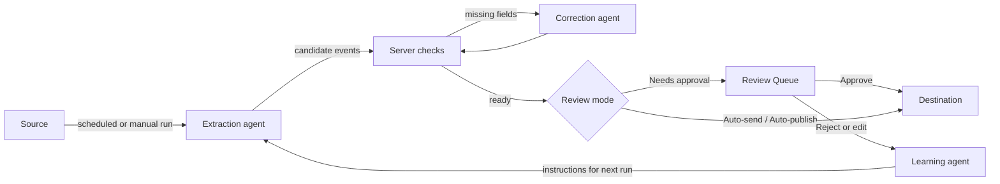

# User guide

How to run a community calendar day to day: adding sources, working the review queue, and reading the results. For installation see [GETTING-STARTED.md](GETTING-STARTED.md).

## Roles

| Role | Can |
| --- | --- |
| **Platform admin** | Everything, across every community: create communities, pick the AI model, see pilot metrics. |
| **Community admin** | Manage their own communities: sources, users, destination, review mode. |
| **Reviewer** | Work the review queue. Can be limited to specific sources. |

One person can belong to several communities and switch between them with the **Community** menu in the sidebar. Everything you see is scoped to the community you have selected.

## The loop

## Sources

A source is one place events come from, usually an organization's events page.

**Adding one.** **Sources → Add source** walks through four steps:

1. **Name**: the organization.
2. **Link**: one or more pages where it lists events.
3. **Schedule**: manual only, every day, every 3 days, every weekday, or every week, and how far ahead to look (1 week to a year; 2 weeks by default).
4. **Instructions**: the app writes a prompt for you to paste into ChatGPT or Claude. That model studies the site and returns short, numbered steps: which URL to fetch, which API to call, which fields to read. Paste them back. The agent follows them on every run.

**Organizations before aggregators.** Mark a source as an *aggregator* when it repeats other organizations' events (a college-wide calendar, say). Aggregators run last, so an event already taken from the organization that runs it is recognised as the copy.

**Organization details.** A source can carry the organization's website, phone and contact email. Events that arrive without their own contact details fall back to these.

**Runs.** Every run is recorded step by step (each fetch, model call and decision) and shown on a live timeline at `/runs/:id`. Use **Run now** to start one by hand. Each run records its real cost from the API's billing.

## Review modes

Set per source, or inherited from the community.

| Mode | What happens to a new event |
| --- | --- |
| **Needs approval** | A person here reads it and approves it before it goes anywhere. |
| **Auto-send** | Skips this queue and waits in the destination's own review queue. |
| **Auto-publish** | Goes live on the destination as soon as it arrives. |

Loosening a source applies to its backlog as well: switching to an automatic mode also sends whatever was already waiting. That cannot be undone, and the switch warns you first.

## The review queue

Each event opens in an editor with a **Readiness** checklist on the right: title, short description, at least one date, an address (if in person) or online link (if online), a category, a sponsor, an image, website, contact email, phone, and screen IDs when the event targets specific signs. If you press Approve with anything missing, the missing fields are highlighted and nothing is sent.

| Action | Effect |
| --- | --- |
| **Approve** | Saves your edits and publishes to the community's destination. |
| **Save changes** | Saves edits and keeps the event in the queue. |
| **Reject permanently** | Removes it with a reason (not an event, duplicate, wrong date, wrong location, wrong category, invented description, unclear title, missing information, other). |
| **Request correction** | Sends the event back to the correction agent with your note. It re-reads the event's own page, fills or fixes the fields, and returns it to the queue. It never approves or publishes. |
| **Show outgoing payload** | Shows the exact data that will be sent to the destination. |

**Images.** Every event needs an image, and it is stored on this server when the event is approved so a third-party host can't break the post later. Paste a direct image URL, paste a copied picture into the Event image box, or use **Upload image from computer**. If the host blocks server requests, the app tries the host's public original first (for example the S3 bucket behind images.locable.com) before asking you to upload.

**Duplicates.** Duplicates are judged by what the event is, not by matching text. A duplicate links to the event it matched so you can check. A play running six nights is one event with six dates; a weekly class is one event.

**Updates to published events.** When a source changes an event that is already published, the new version arrives as a *proposal* linked to the original. Review the differences, then send the update or resolve the proposal.

**Uncertain sends.** If the destination's reply to a send is ambiguous, the event is marked for reconciliation. Check the destination, then record whether the post exists; the app only retries after you confirm it does not.

**Source links.** Every event links back to the exact page it came from. If that page is dead, the app falls back to the nearest working parent or listing page.

Events delete themselves once their last date has begun, so the queue only holds what's coming up.

## Learning from reviewers

Each edit or rejection is turned into one instruction by the learning agent. Every extraction agent receives the active instructions on its next run. **Training Data** lists them; an admin can retire one or turn it back on, and the full set can be exported as training data for a local model.

## Other screens

| Screen | Shows |
| --- | --- |
| **Dashboard** | Active sources, pending review, duplicates, approved and auto-sent counts, a summary per community, and recent runs. |
| **Users** | Invite people, set roles, limit reviewers to sources. |
| **Communities** | Community settings, default review mode, destination endpoint. |
| **Pilot Metrics** | Extraction volume, approval rates, cost per source and model; the platform-wide model picker. |
| **Evaluations** | Side-by-side comparison of an organization's own posts and the importer's records for the same period, for the pilot's research question. |
| **Activity Log** | Sign-ins and every action that changed something, with who did it. |

## Emails

Four emails share one layout: a sign-in link, password set or reset, a community invite, and a digest to reviewers when a run brings in new events.
